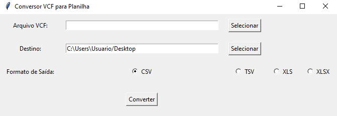
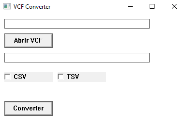

# 📇 VCF to Excel Migrator (Multi-Language)

> Ferramenta de migração de dados de contatos (`.vcf`) para planilhas Excel (`.xlsx`/`.csv`).
> Implementada em duas versões para fins de estudo comparativo de **performance** e **portabilidade**: Python e C.


---

## 📸 Comparação das Interfaces
O projeto conta com interfaces gráficas (GUI) desenvolvidas nativamente para cada ambiente. Abaixo, a comparação visual entre as implementações:

| 🐍 Versão Python | ⚙️ Versão C |
|:---:|:---:|
|  |  |
| *Foco em desenvolvimento rápido (Tkinter)* | *Foco em performance e WinAPI* |

---

## 🎯 Objetivo do Projeto
Este repositório foi criado para demonstrar versatilidade na resolução de um problema real de TI (migração de dados legados e backup de contatos). O mesmo algoritmo de parsing foi implementado em duas linguagens com paradigmas diferentes:

1.  **Python:** Prototipagem rápida, uso de bibliotecas de alto nível e facilidade de manutenção.
2.  **C:** Manipulação de arquivos em baixo nível (File I/O), alocação manual de memória e criação de executáveis nativos leves sem dependência de interpretadores instalados na máquina do cliente.

---

## 📂 Estrutura do Repositório

```text
📂 VCF-To-Excel-Converter
 ├── 📂 python-version
 │    ├── main.py        # Script principal (Lógica + GUI)
 ├── 📂 c-version
 │    ├── main.c         # Código fonte em C puro
 │    └── compilar.bat   # Script de automação de build (Windows)
 └── 📂 assets           # Prints e recursos visuais
```
 
 ## 🚀 Como Executar

### 🐍 1. Versão Python

Pré-requisito: Python 3 instalado.

```bash
cd python-version
pip install pandas openpyxl
python main.py
```

## ⚙️ 2. Versão C (Windows)

Pré-requisito: Windows + compilador configurado.

```bash
cd c-version
compilar.bat
main.exe
```
